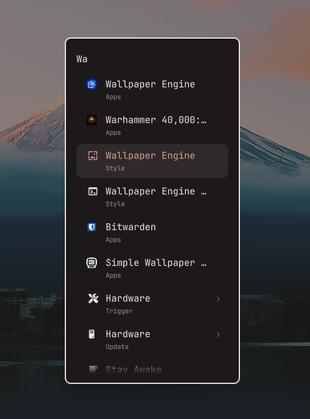

# Steam Game Icons for Omarchy



A headless Omarchy shell plugin that repairs Steam game icons in the app launcher.
It reacts when Steam shortcuts appear or change in Omarchy’s launcher. Existing
Steam entries are checked once when enabled or at session startup. There is no
periodic scan. No bar widget, API key, or network access.

## Install

Enabling this plugin authorizes it to update Icon fields in your user Steam
shortcuts and save local artwork and undo records as described below.

Uses Python and ImageMagick, both included with standard Omarchy. No extra
packages are required.

```sh
omarchy plugin add https://github.com/14brussell/Steam-Game-Icons --enable --yes
```

For a manual installation, copy this directory to
`~/.config/omarchy/plugins/io.github.14brussell.steam-icons`, then run:

```sh
omarchy plugin validate ~/.config/omarchy/plugins/io.github.14brussell.steam-icons
omarchy-shell shell rescanPlugins
omarchy plugin enable io.github.14brussell.steam-icons
```

## Behavior

- Repairs existing user `.desktop` shortcuts with Steam `rungameid` or `run` URLs.
- Replaces generic Steam icons, absent icons, broken absolute icon paths, and
  missing `steam_icon_<appid>` icons. Preserves custom named and working icons.
- Uses installed Steam icons or square hash-named artwork in Steam's library
  cache. Supports native Steam, legacy cache filenames, and Flatpak Steam.
- Copies icons into `$XDG_DATA_HOME/icons/omarchy-steam-icons` as PNGs, so clearing
  Steam's cache won't break repaired shortcuts.
- Saves original Icon fields in `$XDG_STATE_HOME/omarchy-steam-icons/changes.json`.
- Leaves games without cached artwork alone. It retries when the shortcut changes,
  at the next session startup, or when you request a manual scan. Artwork arriving
  by itself does not trigger a scan.

This repairs launcher shortcuts; it does not create shortcuts for an entire
Steam library. Use Steam's Create Desktop Shortcut option for missing games.
It does not fetch artwork, change Steam itself, or replace working custom icons.

## Preview and undo

```sh
python3 steam_icons.py --dry-run
omarchy-shell steam-game-icons status
omarchy-shell steam-game-icons sync
omarchy plugin disable io.github.14brussell.steam-icons
python3 steam_icons.py --restore
```

Run commands from the plugin directory. Undo changes only Icon fields still
pointing to this plugin's artwork, preserving other shortcut edits. Disable
before undoing to prevent the next scan from applying repairs again. Removing
or disabling the plugin leaves repaired icons working; undo first if desired.

## Tests

```sh
python3 -m unittest discover -s tests -v
```

## Remove

To keep the repaired icons, remove the plugin directly:

```sh
omarchy plugin remove io.github.14brussell.steam-icons --yes
```

To restore the original icons, disable the plugin and run `--restore` as shown
above before removing it. Saved artwork and undo records remain in your data
and state directories so removing the plugin does not break repaired shortcuts.

## License

Plugin code is licensed under the [MIT License](LICENSE). Game artwork visible
in the screenshots belongs to its respective owners and is not covered by the
code license.
